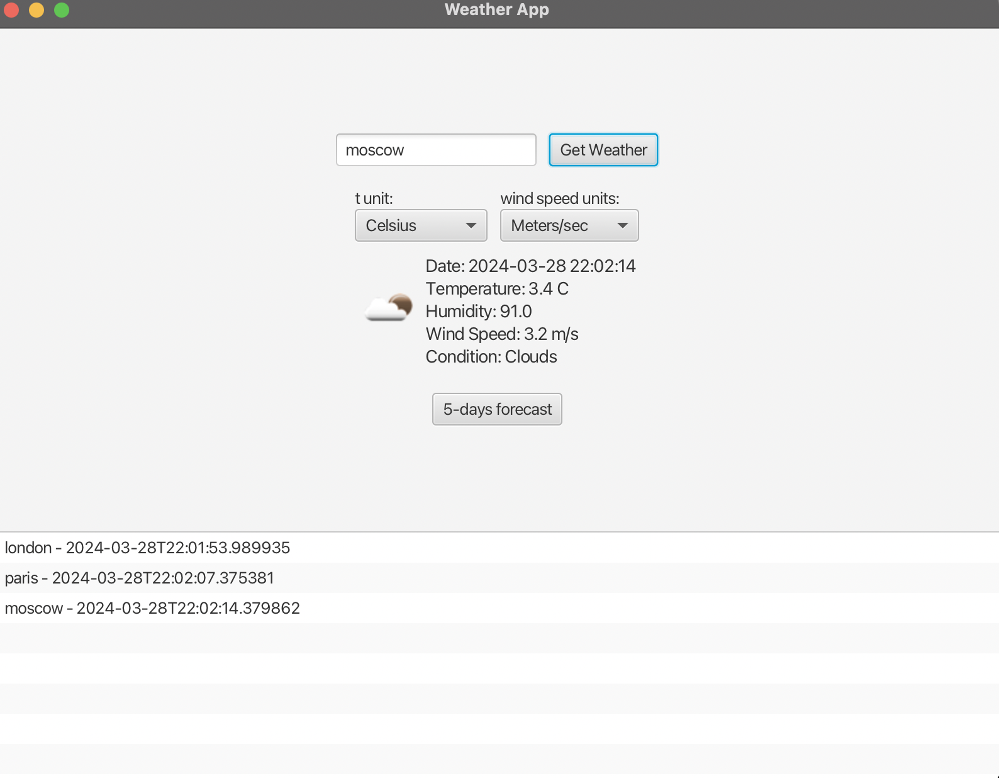
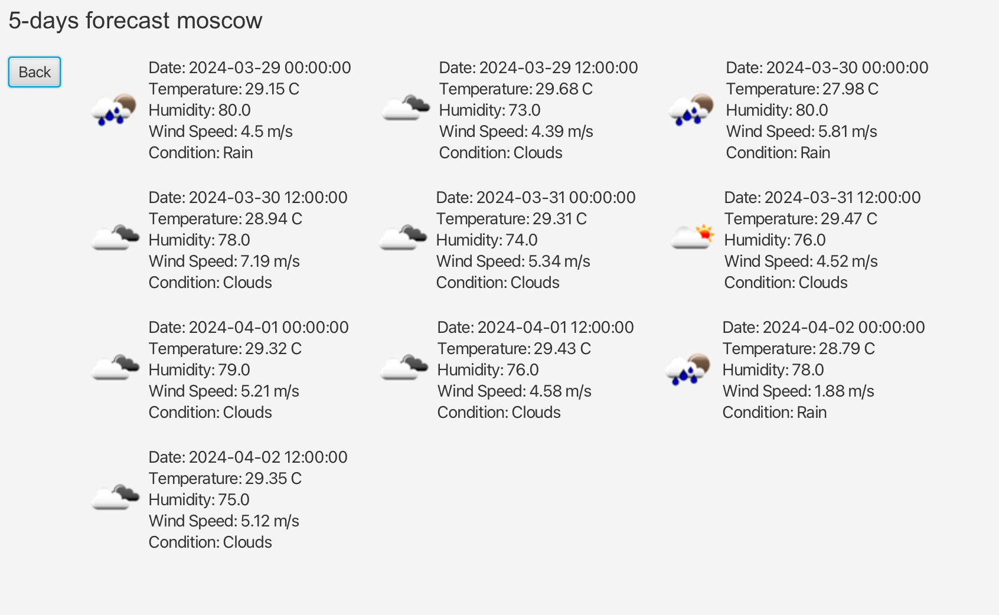

# Weather Forecast Application

This is a Java application that uses the OpenWeatherMap API to fetch and display weather forecast data.

## Features

- Fetches current weather data for a specific location
- Displays a 5-day weather forecast for a specific location
- Uses JavaFX for the user interface

## Classes

- `WeatherAPI`: Interacts with the OpenWeatherMap API to fetch weather data.
- `ForecastDayModel`: Represents the weather forecast for a specific day.
- `ForecastDayView`: Represents the view for a specific day's weather forecast in the Weather App.
- `ForecastView`: Represents the view for a 5-day weather forecast in the Weather App.
- `ForecastWeekModel`: Represents the weather forecast for a week.

## Requirements

- **Java SDK**: This application requires OpenJDK version 22 or higher. You can download it from [AdoptOpenJDK's website](https://adoptopenjdk.net/).
- **IDE**: The application is developed using IntelliJ IDEA 2023.3. You can download it from [JetBrains' website](https://www.jetbrains.com/idea/download/).
- **JavaFX**: This application uses JavaFX for the user interface. Make sure to have JavaFX SDK installed and properly configured in your IDE. You can download JavaFX from [OpenJFX's website](https://openjfx.io/).
- **OpenWeatherMap API**: The application fetches weather data from the OpenWeatherMap API. You need to sign up for a free account to get the API key. You can sign up [here](https://home.openweathermap.org/users/sign_up).

## Setup

1. Clone the repository
2. Open the project in IntelliJ IDEA
3. Run the application

## Using

1. After setting up the application as described in the "Setup" section, run the application.
2. On the main screen, you will see the current weather data for a default location.
3. To view the 5-day forecast, click on the "5-Day Forecast" button. This will take you to a new screen displaying the weather forecast for the next 5 days.
4. Each day's forecast is represented by a card showing the date, temperature, humidity, wind speed, and weather condition.
5. To go back to the main screen, click on the "Back" button on the top left corner of the forecast screen.

- ;
- ;

## Author

Tereshkin Andrey

## License

This project is licensed under the MIT License - see the LICENSE.md file for details

## Roadmap

- Add design
- Add build tools
- 